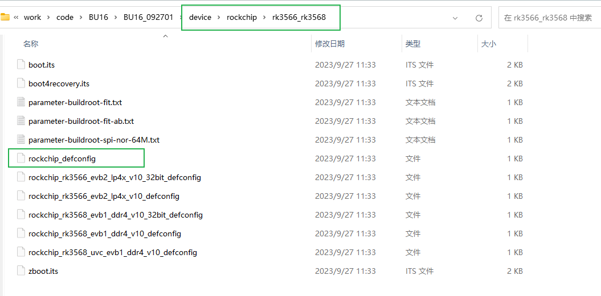
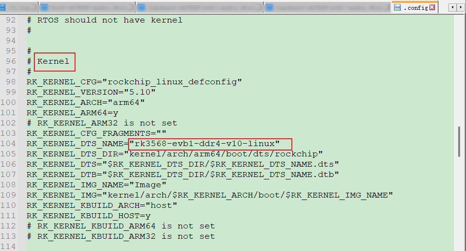

# Linux
## DTS - Device Tree Source

--- 纷繁芜杂，如星星点点；点清且明，如月映波光


### 概述

--- DTS是一种描述==硬件的数据结构==，起源于OF（OpenFirmware）；将驱动代码和设备硬件信息相互隔离；设备树对硬件信息进行抽象，驱动代码则负责逻辑处理 == 》 大量减少了内核当中的冗余代码；

 -  DTS：设备树的源文件，硬件的相应信息都在其中；
    - 每一款硬件一般一个主控，==一个主控SOC对应一个DTS文件==
 -  DTSI：设备树头文件扩展名，相当于C语言的头文件；
    - 一个SOC会对应多个设备，这些设备对于不同的SOC来说都是相同的，因此将这些==相同的DTS配置==抽象为一个.dtsi文件，SOC使用设备时，在DTS文件中包含该DTSI即可；
    - DTSI一般用于描述SOC的内部外设信息，如CPU架构、主频、IIC、SPI、外设(Motor、Fan等)；
    - ==相同节点的配置，dts中的配置会覆盖dtsi的配置，后编译的dtsi也会覆盖之前同节点的dtsi配置==，注意检查节点配置是否重复配置或默认配置先后顺序；
 -  DTC：DTS的编译工具，相当于众所周知的GCC；在内核源码scripts/dtc路径下已包含DTC相关工具
 -  DTB：DTS被DTC编译后的二进制格式设备树文件，才可被linux内核解析；
    - DTB通过Bootloader引导加载到内核当中；


### DTS框架

- Linux kernel设备树路径：

111


手动编译

```bash
 ./scripts/dtc/dtc -I dts -O dtb -o xxx.dtb arch/arm/boot/dts/xxx.dts // 编译 dts 为 dtb
 ./scripts/dtc/dtc -I dtb -O dts -o xxx.dts arch/arm/boot/dts/xxx.dtb // 反编译 dtb 为 dts
```

---

---

### dts注意事项

#### 1. 自行添加dts节点和代码的优势

--- 对于某些开发中常见的功能，可以改代码，使用dts的参数的方法；有利于后续调试仅修改dts参数，尽量解耦合；

---

#### 2. 确定项目DTS所在的位置

--- 基于RK平台

##### 方法一

- ./build.sh lunch
  
- 查看对应的deconfig
  
- 查看细节
  
- 在对应的dts文件里面找包含的DTS和DTSI即可

##### 法二

- 进入output路径，打开.config
  

- 即可看到相应的dts

  


---

## 交叉编译

### Android NDK交叉编译

--- 适用于Android平台，参考AS005文档

### 项目源码环境 

--- 适用于Android平台，参考AS005文档

### 源码编译后的输出目录下进行环境编译

--- 适用于 Linux；应该也适用于android(未验证)

- Linux
  一般会在buildroot/output/rockchip_rkxx/host下 
  - buildroot/output/rockchip_rkxx/host/bin  看编译版本
  - 在buildroot/output/rockchip_rkxx/host/  写源码 hello.c
  -  ./host/bin/arm-buildroot-linux-gnueabihf-gcc hello.c -o hello
- android
  待后续验证补充


