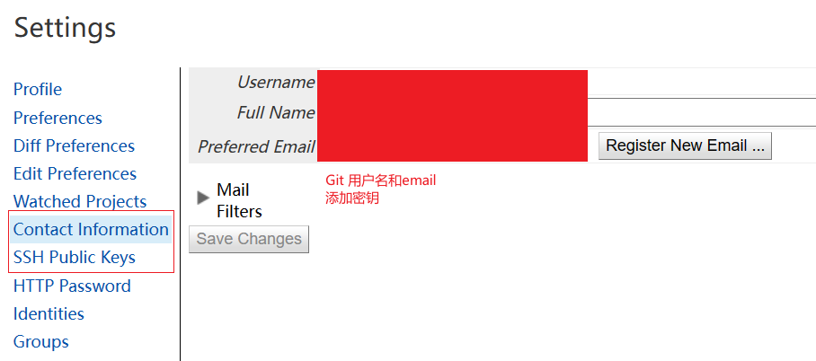
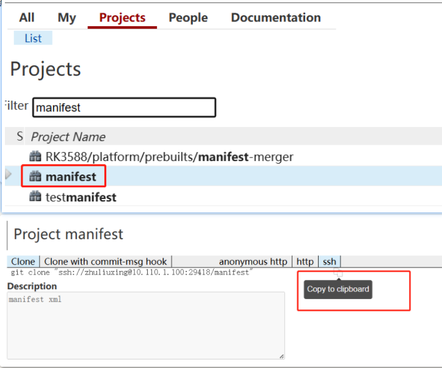
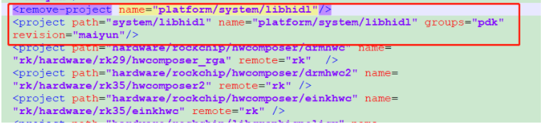
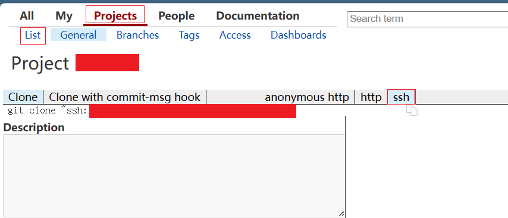

# Git/Gerrit平台

--- Git比svn好用

--- Gerrit一款开源免费的代码评审平台，基于GIT的版本控制系统，目前国内大多数公式均采用Gerrit平台进行代码评审/<mark>review</mark>管控。
==> 项目主要使用该平台进行Merge审核。

## Gerrit添加账号和密钥



- Gerrit的版本有时候不支持常用的RSA加密方式
  --- 如在使用WSL2时，github可以正常拉取代码，gerrit会显示不识别，此时换一种更先进的加密方式，如ed25519格式的密钥，可以使得gerrit正常

---

## Gerrit添加仓库和分支

1：联系管理员添加分支

2：添加仓库到manifest

- 拉manifest


3：修改相应分支仓库

- manifest\rk_manifests\include\rk_modules_repository_maiyun.xml


4：提交merge后，需<mark>重新init</mark>该仓库所在项目，而后再提交相关代码

---

## Gerrit拉取代码

--- Gerrit拉取代码和github差不多

- 拉取代码

  

git clone "ssh链接"即可

- repo init

  ```c
  repo init --repo-url=ssh://替换成自己@10.110.1.100:29418/repo --no-repo-verify --repo-branch=reponew -u ssh://替换成自己@10.110.1.100:29418/manifest.git -m rk_3568_manifests/rk3568_linux_bu16.xml
  ```

  出现and try again是正常的；

- repo sync 即可

---

#### Gerrit 基线-同步/编译/提交/撤销/回退

- 同步代码

  ```c
  repo sync -c --no-tags     -j32  
  //**--no-tags** don't fetch tags.该选项指定不获取服务器上的tag信息
  ```

- 清除、重置(丢弃分支)、同步

  ```c
  repo forall -c git clean -fd && repo forall -c git reset --hard && repo sync -c --no-tags
  ```

- 编译
  ```c
  //编译
  source build/envsetup.sh
  lunch 40
  ./build.sh -AUCKu
  ```
  
- 提交

  ```c
  //代码提交
  # 添加这两个文件
  git add 文件名1 文件名2
  
  # 添加所有文件
  git add . 
  
  # 添加已跟踪文件
  git add -u .
  
  # 添加已跟踪和未跟踪的文件
  git add -A .
  
  # 取消添加该文件
  git reset HEAD+文件名         
  ```

  ```c
  //example
  # 添加所有changes文件
  git add .
  git commit -m "[Project][Module]Add for xxx by xxx"
  
  # 查看分支
  git branch -a
  * (HEAD detached from 984f637aa77e)
    remotes/m/master -> origin/a1
    remotes/origin/a1
    remotes/origin/master
  
  # 推送至a1分支上
  git push origin HEAD:refs/for/a1
  ```

- 撤销

  ```c
  git reset --hard HEAD (撤销最新的提交) 
  git reset --hard HEAD^ (撤销上一次提交) 
  git reset --hard HEAD^^ (撤销上上一次提交) 
  git reset --hard commit ID (commit ID指的是通过git log看到的commit后面的一长串ID的前7位)
  ```

- 回退/恢复

  ```c
  git log
  git checkout -f 487de35b82fd72b78058b7c5efa34e9a59e0bb87 
  
  git reset --hard "xxxxxxxx"
  ```

---

#### Gerrit-本地分支-查看/创建/切换/重命名/删除

- 查看

  ```c
  # 查看本地分支
  git branch
  
  # 查看远程分支
  git branch -r
  
  # 查看所有分支
  git branch -a
  ```

- 创建

  ```c
  # 仅创建
  git branch name（分支名）
  
  # 创建并直接切换至该分支
  git checkout -b name(分支名)
  ```

- 切换

  ```c
  git checkout name（分支名）
  ```

- 重命名

  ```c
  # 重命名本地分支
  git branch -m old_name new_name
  ```

- 删除

  ```c
  # 删除本地分支
  git branch -d name
  
  # 删除远程分支（小卡拉米用不到的）
  git push origin -delete :name 
  ```
---

#### Gerrit-本地远程仓库对比

- 更新本地远程分支后与本地分支进行对比

  ```c
  # 更新本地远程分支
  git fetch origin
  
  # 对比
  git diff 本地分支 origin/xxx
  ```
  

---

#### Git-patch 打包/应用

- 打包

  ```c
  # 打包最近的一个log
  git format-patch -1
  # 打包最近的两个log
  git format-patch -2
  # 同理打包最近的n个log
  git format-patch -n
  
  # 打包n1、n2版本间的patch
  git format-patch -n1 -n2
  
  # 打包从根到指定log的所有patch
  git format-patch --root 6a99bdd14b66de695519cca7a72d9b652e9bfdc7
  
  # 将patch输出到指定文件
  git format-patch xxx --stdout > xxx.patch ==> git format-patch -4 --stdout > 1.patch
  ```

- 应用

  ```c
  # 合并指定log
  git am xxx.patch
  ```


---

#### Git-Fork/上传

- Fork

  ```c
  git clone xxxx(ssh)
  ```

- 上传自己本地仓库

  ```c
  rm -r .git //删除原有git信息
  git init
  git add .
  git commit -m "xxxx"
  //提前在git官网新建repository
  git remote add origin 远程库地址(如：git push --set-upstream origin master)  
  git push --set-upstream origin master
  ```
  
---

  #### gitignore

- 忽视如out等文件
  --- 在.git同目录下

  ```c
  touch .gitignore //生成gitignore文件
  vim .gitignore   //改下需要忽略的文件
  
  .gitignore 文件本身可以忽略
  ```

- 权限引起的git status未显示变化，但是vscode等ide显示changes
  --- 忽略权限即可

  ```c
  项目修改：git config core.filemode false
  全局修改：git config --global core.filemode false
  ```


---

#### Git/Gerrit/Repo-error

- error: failed to push some refs to

  ```c
  # 本质是第一次提交缺失Readme文件，第一次初始提交问题，按照出错提示即可
  example：
  gitdir=$(git rev-parse --git-dir); scp -p -P 29418 xxxx@10.110.1.100:hooks/commit-msg ${gitdir}/hooks/
  git commit --amend --no-edit
  ```

- invalid syntax

  ```c
  # 普通用户repo失效
  mkdir -p ~/.bin
  PATH="${HOME}/.bin:${PATH}"
  curl https://storage.googleapis.com/git-repo-downloads/repo > ~/.bin/repo
  chmod a+rx ~/.bin/repo
  ```

- python版本错误

  ```c
  //2.0/3.0 pyhton版本的老问题了
  # 查看当前默认python版本
  python --version
  
  # 查看python3位置
  whereis python3
  
  # 删除原有python2软链接
  rm /usr/bin/python
  
  # 链接3.x版本的软链接
  ln -s /usr/bin/python3.x /usr/bin/python
  
  # 重新检查当前python版本
  ```

- git status未显示改动，但是VSCODE显示changes
  --- 文件权限导致changes提升
  = =》忽视文件权限即可

  ```c
  项目修改：git config core.filemode false
  全局修改：git config --global core.filemode false
  ```
