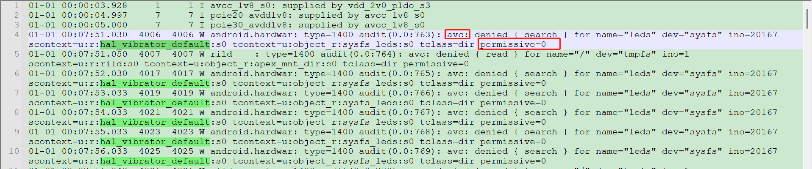
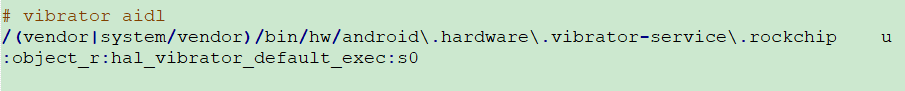

# Android Sepolicy
## 简介

--- Android安全模型的一部分，一种权限管理策略，即使是进程具有root权限，SELinux也能通过创建⾃动化的安全策略(sepolicy)来限制特权进程来增强 Android的安全性 ；主要就是限制Android的权限，避免滥用造成的安全风险问题。

---

## 查看selinux的详情

- ps -z
  --- 显示selinux的角色、类型、安全级别；格式：user：role：type：rank

  ```shell
  ps -Z
  
  LABEL USER PID PPID NAME
  u:r:init:s0 root 1 0 /init
  u:r:kernel:s0 root 2 0 kthreadd
  ...
  ```

  - user；SEAndroid中定义了⼀个SELinux⽤户，值为u；
  - role；role是⾓⾊之意，它是SELinux中⼀种⽐较⾼层次，⼀个u可以属于多个role，不
    同的role具有不同的权限；
  - init；代表该进程所属的Domain为init，是这个进程type，在andorid⾥⾯，定义了100多
  - type；进程所属的类型；
  - S0；是⼀个安全的等级MLS将系统的进程和⽂件进⾏了分级，不同级别的资源需要对应级别的进程
    才能访问；

---

## selinux 关键文件

- 政策文件 

  --- 文件格式：以*.te 文件结尾

  --- 路径：/device/manufacturer/device-name/sepolicy

  ==> 一般尽可能的更新现有文件，  也可创建新的政策文件

- 上下文描述文件

  - file_contexts：文件分配标签
  - genfs_contexts：为不支持扩展属性的文件系统(proc、vfat)分配标签
  - property_contexts：为Android系统属性分配标签，便于控制哪些进程可以设置这些属性
  - service_contexts：Android Binder 服务分配标签，以便控制哪些进程可以为相应服务添加
    （注册）和查找（查询）Binder 引⽤  
  - seapp_contexts：为应⽤进程和 /data/data ⽬录分配标签 
  - mac_permissions.xml：根据应⽤签名和应⽤软件包名称（后者可选）为应⽤分配 seinfo 标
    记  

- BoardConfig.mk makefile  

  ```makefile
  修改或添加政策⽂件和上下⽂的描述⽂件后，请更新您的 /device/rockchip/devicename/BoardConfig.mk
  BOARD_SEPOLICY_DIRS += \
  		<root>/device/rockchip/device-name/sepolicy
  (8.0+版本不需要修改以下⽂件)
  BOARD_SEPOLICY_UNION += \
              genfs_contexts \
              file_contexts \
              sepolicy.te。
  ```

---

## selinux 问题确认

1. user版本相关功能不正常，userdebug版本功能正常，可能为selinux权限问题;
2. kernel log、logcat中出现<mark>avc：denied</mark>字样log，需进一步复现确认是否为selinux权限问题;

- selinux 权限开启/关闭

  ```makefile
  adb shell setenforce 0
  setenforce 0 设置SELinux 成为permissive模式 临时关闭selinux
  setenforce 1 临时打开selinux
  ```

- selinux 相关log抓取

  ```shell
  adb shell logcat | grep avc
  或 ad
  b shell dmesg | grep avc
  ```

---

## sepolicy rule 读法/添加/验证

- selinux log读法/添加
  --- 一般缺少search、write、read权限都如下：

  ```shell
  01-01 00:07:51.030  4006  4006 W android.hardwar: type=1400 audit(0.0:763): avc: denied { search } for name="leds" dev="sysfs" ino=20167 scontext=u:r:hal_vibrator_default:s0 tcontext=u:object_r:sysfs_leds:s0 tclass=dir permissive=0
  
  1. 缺少 search 权限
  2. hal_vibrator_default 缺少权限
  3. sysfs_leds 这个节点缺少权限
  4. dir 类型文件
  如上；需添加：allow hal_vibrator_default sysfs_leds:dir search
  ```

  ----：

  - 权限问题一般不能一次性解决，可能会在一次权限问题解决后再提示下一个权限问题，需一次次给予新的权限；

  - 当需要加入很多权限时，推荐采用宏的方式添加

    allow hal_vibrator_default sysfs_leds:dir {search write add_name create  }；

- selinux 添加

  - 法一

    ```shell
    如上：allow hal_vibrator_default sysfs_leds:dir search
    ```

    ==>：

    将对应的policy添加到te文件中；⼀般添加在 /device/<company>/common/sepolicy 或者
    /device/<company>/$DEVICE/sepolicy ⽬录下，具体哪个⽬录，请执⾏get_build_var 查看  

  - 法二
    --- 使用audit2allow ⼯具⽣成对应的 policy 规则；暂未使用过

- 修改生效：重新编译烧录抓log检查

---

## 案例：Motor驱动

1：userdebug：会上报avc问题，但permission=1仅上报不阻止

​	 user：上报avc问题，permission=0，阻止；需给相关avc权限



- avc问题读法

```log
01-01 00:07:51.030  4006  4006 W android.hardwar: type=1400 audit(0.0:763): avc: denied { search } for name="leds" dev="sysfs" ino=20167 scontext=u:r:hal_vibrator_default:s0 tcontext=u:object_r:sysfs_leds:s0 tclass=dir permissive=0
如上：需添加allow hal_vibrator_default sysfs_leds:dir search
```

2：解决方案

MaiYun\device\rockchip\common\sepolicy\vendor目录下无hal_vibrator_default.te相关文件

但MaiYun\device\rockchip\common\sepolicy\vendor\file_contexts下有vibrator_aidl描述;



- 直接添加hal_vibrator_hal.te文件并添加所需allow


经修改后解决user版本无vibrator相关avc错误；userdebug仍有部分vibrator相关avc错误，如需解决，增加相关权限即可。
如还有selinux相关问题则参考：RK-Android Sepolicy配置指导。

==> 补充：
AIDL、HIDL都是用于跨进程通信；将上层与底层分隔开

AIDL：Android Interface Definition Language(Android接口定义语言)

HIDL：Hardware Abstract Layer
--- HIDL 则是改变之前上层直接调用 HAL 层的模式，而是将 HAL 层作为一个服务启动，当上层需要调用时是作为 client 来请求服务的
