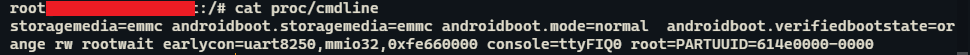

# u-boot
参考自：[U-Boot 之八 详解 Driver Model 架构、配置、命令、初始化流程_u_boot_driver_ZC·Shou的博客-CSDN博客](https://blog.csdn.net/ZCShouCSDN/article/details/128600865#:~:text=U-Boot 的 DM 使用 uclass 和,udevice 这两个抽象的类来管理所有的设备驱动，这两个抽象类分别各自对应 uclass_driver 和 driver 。)

- u-boot 的设备树和kernel共用一套；目前均采用设备树的方式配置

- u-boot的config不共用，一般在：u-boot\configs\xxxx_defconfig下

- 目前u-boot引用自己的Driver Mode（官方简称 DM）驱动架构

  ---需开启CONFIG_DM_GPIO=y 宏和相关器件的宏

- u-boot 最主要的两个宏：

  ```c
  UCLASS_DRIVER(__name) ==> uclass
  U_BOOT_DRIVER(__name) ==> udevice
  
  --- 初始化中，u-boot会遍历这些节区，然后进行内容匹配，依次创建各种设备和对应的UCLASS
  ```

  

  ==》 只有driver存在时，才会创建uclass
  
  uclass` 是根据 `uclass_driver动态创建的。

## u-boot参数--cmdline

--- cmdline 由多个数据拼接而成，将重复数据过滤后再传给kernel；
--- cmdline 是uboot引导内核启动时传给内核的，作用是指导内核启动；内核启动阶段会去解析cmdline，按照cmdline去指导内核启动

- 查询cmdlie

  ```c
  cat proc/cmdline
  ```

  

- cmdline 参数说明

  - [iTOP-RK3568开发板Uboot参数-内核启动参数cmdline_rk3568 uboot bootarg-CSDN博客](https://blog.csdn.net/mucheni/article/details/130727385)

  
